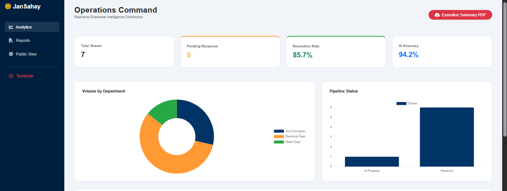
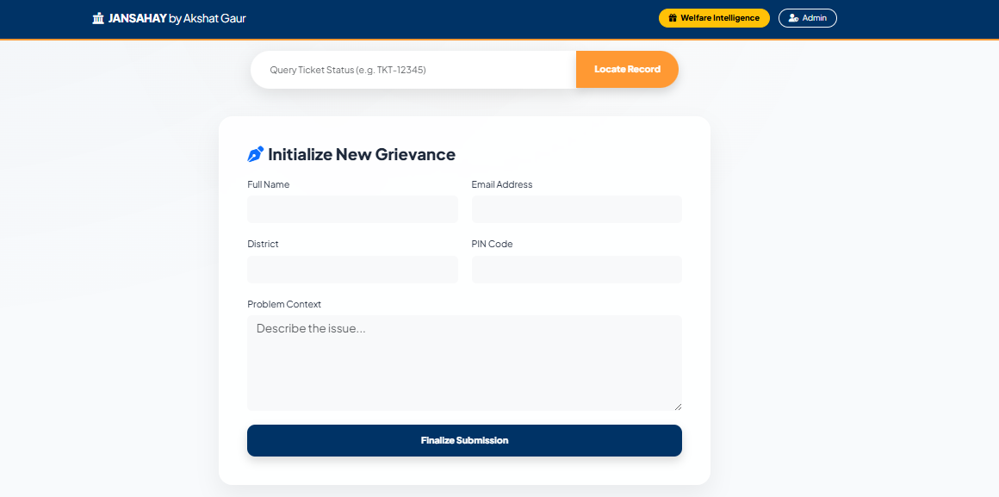
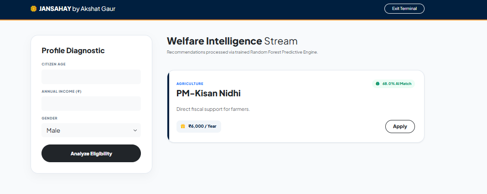
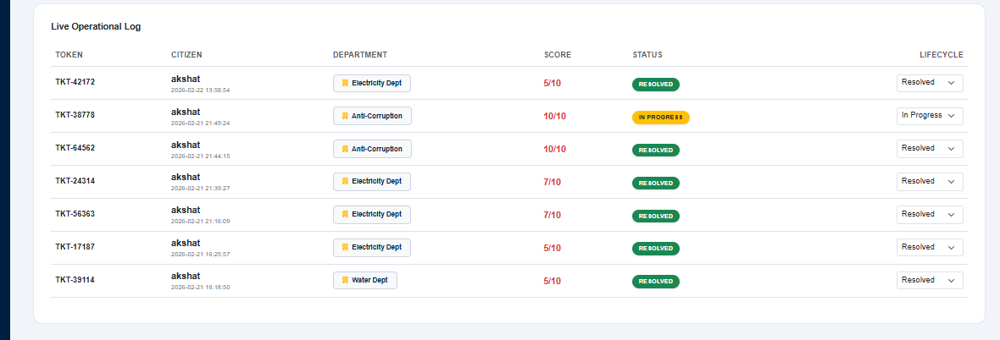

# JanSahay – AI Governance Intelligence System

JanSahay is an AI-driven grievance redressal and welfare eligibility platform designed to reduce administrative latency using hybrid machine intelligence.

The system integrates Natural Language Processing (NLP) and Predictive Analytics to automate grievance routing, prioritize citizen complaints intelligently, and recommend welfare schemes using demographic data insights.

---

## 📸 System Preview

## 🎥 Demo Video
[Watch Demo](demo.mp4)

### 🔹 Operations Dashboard


### 🔹 Grievance Submission System


### 🔹 Welfare Intelligence Engine


### 🔹 Admin Monitoring Log


---

## 🎯 Problem Statement

Traditional e-governance systems face significant challenges due to manual grievance sorting, delayed response cycles, and lack of personalized welfare delivery mechanisms. Citizens often remain unaware of schemes they qualify for due to fragmented information systems.

JanSahay addresses these issues through automation, intelligent classification, and real-time analytics.

---

## 🧠 System Architecture

### 🔹 Kernel A – NLP Grievance Engine

• TF-IDF vectorization for text preprocessing  
• Multinomial Naive Bayes for department classification  
• Heuristic priority scoring using sentiment + keyword density  

---

### 🔹 Kernel B – Welfare Recommendation Engine

• Random Forest classifier for eligibility prediction  
• Demographic-based feature modeling  
• Confidence score-based scheme ranking  

---

### 🔹 Hybrid Intelligence Framework

• Human-in-the-loop governance design  
• Deterministic routing overrides for ethical compliance  
• Non-blocking workflow architecture for smooth UX  

---

## 🛠 Tech Stack

**Backend:** Flask (Python)  
**Machine Learning:** Scikit-Learn  
**Database:** SQLite  
**Visualization:** Chart.js  
**Communication Layer:** SMTP (Automated Notifications)

---

## ⚙️ Installation & Setup

```bash
git clone https://github.com/akshatgaur64/jansahay-ai-grievance-system
cd jansahay-ai-grievance-system
pip install -r requirements.txt
python app.py
